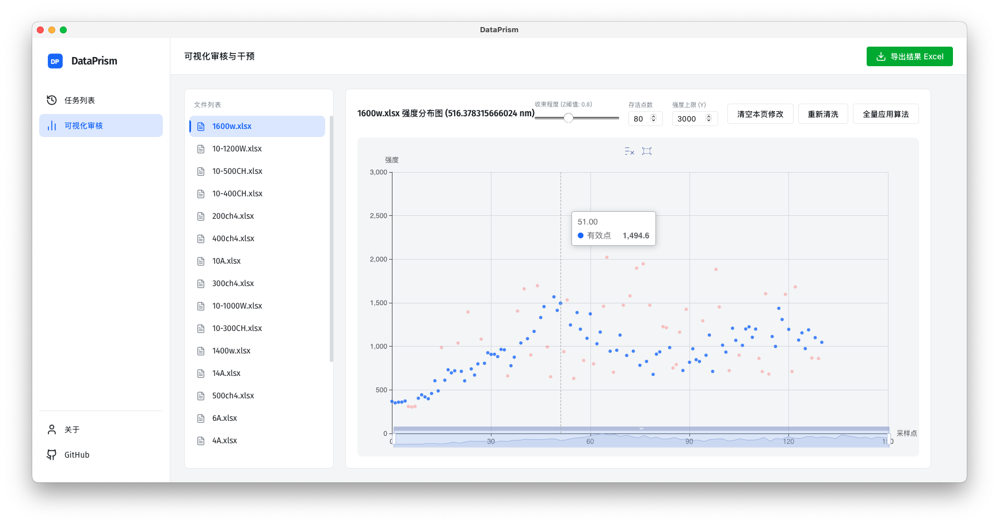

# DataPrism

**DataPrism** 是一款专为光谱/波长强度数据处理设计的桌面端工具。它解决了海量“波长-时间-强度”Excel数据文件中进行提取、清洗和人工校准的效率痛点。

## 核心特性

- **多文件批量处理**：一键扫描文件夹，批量提取指定波长的强度数据。
- **智能数据清洗**：基于 Z-Score 及局部中位数的算法自动识别并过滤离群噪点。
- **可视化干预**：交互式散点图预览，支持手动点击或框选以精细化调整过滤结果。
- **现代化架构**：基于 Tauri + Vue 3 + ECharts 构建，轻量、原生且高性能。
- **专业导出**：一键导出清洗后的标准 Excel 报表，直接用于后续分析。

## 技术栈

- **Frontend**: Vue 3, Vite, ECharts, Lucide Icons
- **Backend**: Rust, Tauri v2
- **Database**: SQLite (via tauri-plugin-sql)
- **Excel Processing**: SheetJS (xlsx)

## 开发与编译

```bash
# 安装依赖
npm install

# 启动开发环境
npm run tauri dev

# 构建生产版本
npm run tauri build
```

