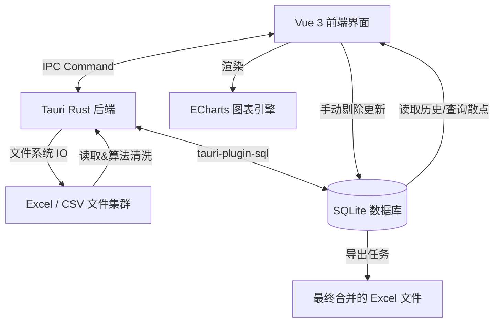

# 项目架构设计文档：rou-tools

## 一、 项目概述
**rou-tools** 是一款专为光谱/波长强度数据处理设计的桌面端工具。它解决了海量“波长-时间-强度”Excel数据文件中进行提取、清洗和人工校准的效率痛点。本应用基于现代化的轻量级桌面架构，实现多文件批量处理、基于 Z-Score 及局部中位数的算法自动过滤、可视化干预人工审核与结果的最终导出。

## 二、 系统架构与技术栈选型

### 2.1 技术栈结构
* **客户端壳与系统层**：Tauri (Rust) — 提供轻便小巧、高性能的系统交互底座，管理文件 IO 和系统对话框进程。
* **前端渲染层**：Vue 3 + Vite — 提供无与伦比的冷启动速度和流畅的组件化开发体验。
* **UI 展现层**：Vanilla CSS — 原生 CSS 极致轻量，采用系统化变量管理，不依赖庞大 CSS 框架，确保“工业极简风格”绝对纯度。
* **图表可视化层**：ECharts — 核心底层支撑 Canvas/WebGL 大规模散点图的高性能渲染及框选交互。
* **数据持久层**：SQLite (通过 tauri-plugin-sql 集成) — 本地化、原子级数据持久存储，保障海量原始数据、清洗过程与手工干预的数据可靠性。
* **图标组件库**：Lucide Icons — 线条一致的极简矢量 SVG 图标库。

### 2.2 数据流向图

## 三、 UI/UX 设计规范 (ui-ux-pro-max: 现代工业极简风格)

为契合“数据处理、工业极简、专业高效”的产品定位，遵循 ui-ux-pro-max 注入的设计思想，以**飞书 (Feishu/Lark)** 设计语言为色彩和交互参照模型。

### 3.1 设计策略 (Design Strategy)
* **核心模式**：单页面工作流 (Single Column Workflow)。核心聚焦：提取配置 -> 可视化大盘与参数动态调优 -> 数据导出。
* **页面留白**：使用大量负空间 (Whitespace) 将视区引导至核心的数据图表与主操作区。
* **扁平无投影**：摒弃繁重阴影、渐变和复杂毛玻璃特效，专注 2D 专业感。
* **边界感建立**：通过极细边框 (`1px solid #EBECEF`) 和弱灰底色板块进行层级与区域划分。

### 3.2 色彩系统 (Feishu-Inspired Palette)
| 角色 | 颜色变量 | Hex 值 | 用途 |
| --- | --- | --- | --- |
| **品牌主色 (Primary)** | `--color-primary` | `#3370FF` | 核心操作按钮、选中状态、ECharts 散点主色群 |
| **主色悬停 (Hover)** | `--color-primary-hover` | `#1E50DE` | 操作按钮的悬浮反馈 |
| **应用大底色 (Base)** | `--color-bg-base` | `#F5F6F7` | 桌面端最底层背景，减少视觉疲劳 |
| **面板背景 (Surface)** | `--color-surface` | `#FFFFFF` | 数据操作卡片、弹窗与侧边栏背景 |
| **主文本体 (Text Main)** | `--color-text-main` | `#1F2329` | 系统标题、主要数据值域、核心引导段落 |
| **次要辅助 (Text Muted)**| `--color-text-muted` | `#8F959E` | 表头字段说明、次要状态指示、图表坐标刻度 |
| **警示危险 (Warning)** | `--color-danger` | `#F54A45` | 清除任务、图中异常判定点、人工剔除操作标识 |

### 3.3 排版与字体 (Typography)
* **字体核心要求**：高度理性的技术风格，增强仪表盘与数据的可读性。
* **常规文字 (Body)**：`Fira Sans` —— 用于页面大部分结构文本说明，兼具优雅和现代。
* **数据/核心态 (Monospace)**：`Fira Code` —— 高频出现于数字参数设定、表格内数据呈现和坐标系数值。它能保证长短不一的浮点数绝对垂直对齐。

### 3.4 交互体验防坑指南 (UX Best Practices)
1. **反馈即时响应**：微交互过场动画与颜色过渡统一配置 `transition: all 150ms ease-in-out`。
2. **指针与状态约束**：应用所有非禁用、具点击能力的元素必须具备 `cursor-pointer`。所有可点击行（List Items）要有 Hover 态表现层（如暗化背景 3-5%）。
3. **禁用 Emoji**：以严谨桌面端面貌示人，严禁使用 Emoji 符号表示任何状态或流程，统一由 `<LucideIcon>` 渲染原生 SVG 替代。

## 四、 核心业务引擎与算法架构

工具底层的计算核心在于：抹平光谱/波长分析仪器采样过程中的“极值杂音”。

### 4.1 数据双轨机制
为保证校核过程“进可攻退可守”，系统内任何一条时间序列都会平行运转在双轨上：
1. **Raw State (原始现场保留)**：提取出的绝对原始值入库保存。
2. **Filtered State (清洗后态)**：算法执行后的干净数据通道（人工剔除操作亦更改此状态）。

### 4.2 强力离散收束：中位数算法
基于算法工程实现逻辑（参考 `process_excel.js`）：
* **局部窗口基准线**：滑动窗口法 (Size = 11)，计算当前坐标附近的“局部中位数”，形成无视异常突刺（如高达 20000 的故障峰值）的绝对基线。
* **局部方差核算**：动态评估当前时段原始数据的自身厚度和自然波动幅度 (标准差/StdDev)。
* **极度严苛 Z-Score 斩首**：偏离局部中位数 `Z-Score > 0.8` 的坐标点立即作为离群突刺处理。
* **极端防斩断保险 (Min-Keep)**：当整体有效点不足保底安全线（本系统设为 80-100 个），放弃 Z-Score 硬拦截，改为按点偏离幅度大至小进行降级舍弃，确保存活点数量下限。

### 4.3 动态重清洗反馈机制 (Dynamic Re-Cleaning)
由于光照强度与实验环境多变，全局清洗参数不可避免面临“有的文件杀得太狠，有的没切断”的问题：
* **交互式调参控件**：在人工预览大图的控制侧边栏或悬浮面板植入直观的控件面板，允许实时微调 **强力离散收束度 (Z-Score 阈值)** 与 **安全存活点数量 (Min-Keep)**。
* **清洗作用域控制**：提供按钮选项，准许基于这组新参数「仅对当前预览文件重算」或是「一键应用至当前任务全量文件」。
* **无损沙盒重计算**：因为 `Raw State` 和数据库表结构的底层解耦支持，当触发重洗时，后端只需重读包含原始值的点重新送入最新阈值的降噪滤网，直接复写 `is_deleted` 与 `filtered_value`，图表即时重渲，实现了所调即所得的业务自由度。

## 五、 数据库实体模型设计 (SQLite)

利用 Tauri local DB (如 tauri-plugin-sql) 在用户本地进行强关系的数据建模。

### 1. 任务主表 (tasks)
用以回放及审计所有历史文件处理结果。
| 字段名 | 类型 | 描述 |
| --- | --- | --- |
| `id` | INTEGER PK | 核心任务ID |
| `name` | TEXT | 任务备注或者默认按时间串命名 |
| `target_wavelength` | REAL | 配置的目标提取波长 |
| `created_at` | DATETIME | 创建时间戳 |
| `status` | TEXT | 状态标识符: 'PROCESSING', 'PENDING_REVIEW', 'COMPLETED' |

### 2. 子文件清单表 (file_records)
挂载在 Task 下，存放选定文件夹内的单个文件级别记录。
| 字段名 | 类型 | 描述 |
| --- | --- | --- |
| `id` | INTEGER PK | 内部索引ID |
| `task_id` | INTEGER FK | 外键 -> tasks.id |
| `file_name` | TEXT | 源文件名称与后缀 (如 `2A.xlsx`) |

### 3. 数据散点宽表 (data_points)
核心吞吐域表。须将 `(task_id, file_id)` 设为复合联合索引，为 ECharts 十万至百万级图表绘图争取极限提取速度。
| 字段名 | 类型 | 描述 |
| --- | --- | --- |
| `id` | INTEGER PK | 点ID |
| `file_id` | INTEGER FK | 追溯外键 -> file_records.id |
| `x_index` | INTEGER | Time-Index (等同于图表的 X轴递增横坐标 1,2,3...) |
| `original_value` | REAL | Excel 解析器获取的原始数值 (Y轴) |
| `filtered_value` | REAL | 算法修正后的数值存储位置 |
| `is_deleted` | INTEGER | 状态标识字段：`0` 未删除 / `1` 被中位数算法过滤 / `2` 经前端图形界面由人工抹去 |
